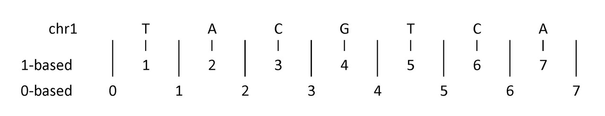
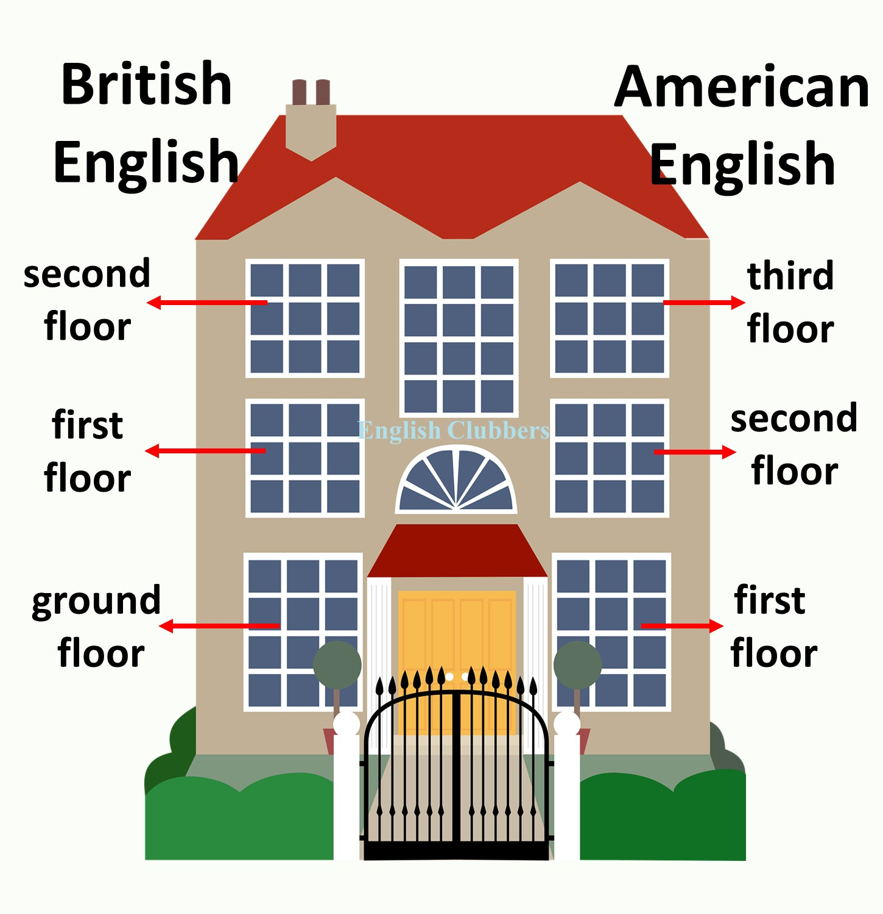
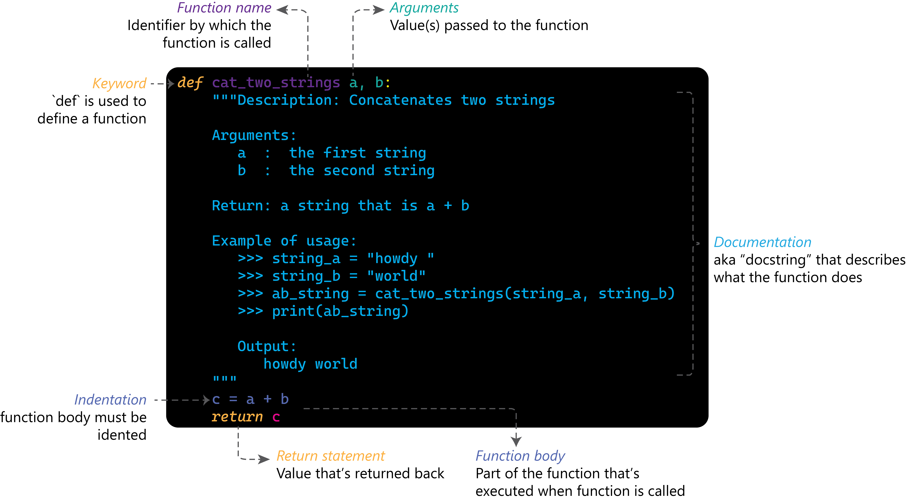

<!-- _class: lead -->

# Python for data analysis
## EEOB 5460

---

<!-- _class: section -->

# Session 1: Why Python?

---

<!-- _class: top -->

# Why use Python for data analysis?

- High-level, general purpose language
- Good for cleaning, visualizing, and modeling data
- Strong scientific ecosystem
-- active community
-- large number of useful libraries
- Useful for reproducible workflows
- Works well with notebooks and scripts

---

<!-- _class: top -->

# Okay, but what about R?
- R <i>is</i> useful for many applications
- R also has a strong ecosystem and active community
- R has many of the same libraries
- R can also create reproducible scripts

---

<!-- _class: top -->

# So why do I need another language
- Python is a <i> general purpose </i> language
-- Machine learning
-- Webscraping
-- API interfacing
-- Parsing complex file formats
-- Software engineering

<center><strong>You may need to edit or add to a python pipeline</strong>

---
# Can't AI just do it for me?

- ChatGPT, GitHub Copilot, Claude -- they all produce working code
- You've been told not to use it
- You're going to use it anyway

<br>

Let's talk about **how to use it without sabotaging yourself**

---

# The Vending Machine Problem

Imagine learning to "prepare food" by only ever using a vending machine

> You get food, but you never learn to cook food. You only ever get the food that the vending machine has handy, and not what you really want.

<br>

Our goal isn't just to have code that runs. **Our goal is learn the fundamentals that allow us to understand and write code**.

---
# Fundamentals allow you to use AI efficiently

Learning to code builds **mental models** of how things work

<div class="twocol-bottom">

<div>

```python
# When you struggle through this...
for i in range(5):
    print(i)

# ...your brain is building a model of:
# - what a loop IS
# - what "range" returns
# - how indentation creates scope
# - what happens step by step
```
</div><div>

**That struggle is helps you understand how the code is constructed**

Skipping the struggle means that when AI returns something not quite right you will: 
- not identify it as a problem
- not know how to fix the problem
- not know how to tell AI where to begin to fix the problem

<div>

---


# Python vs R: Syntax at a Glance
| Concept | R | Python |
|---------|---|--------|
| Assignment | `x <- 5` or `x = 5` | `x = 5` |
| Function | `function(x) { }` | `def f(x):` |
| Indexing | `x[1]` (1-based) | `x[0]` (0-based) |
| String length | `nchar(s)` | `len(s)` |
| Substring | `substr(s,1,3)` | `s[0:3]` |
| Print | `print(x)` | `print(x)` |
| Length | `length(x)` | `len(x)` |

---

# Python vs R
<div class="twocol-bottom">

<div>

### Python

```python
a = 5
b = 3
c = a + b

if c > 5:
    print("c is greater than 5")
```
</div> <div>

### R
```R
a <- 5
b <- 3
c <- a + b

if (c > 5) {
  print("c is greater than 5")
}
```
</div>

---

# Readability of Python
<div class="twocol-bottom">

<div>

### Pseudocode

```
seq = "...ACGT..."
count = 0
for base in seq
    if base is a 'G'
        increment count
print count
```
</div><div>

### Python
```Python
seq = 'GACTTAATGGGCCAACGACATGAAAACACAAGACAA'
count = 0
for base in seq:
    if base == 'G':
        count += 1
print(count)
```
</div>

<div>
This is what you outline
</div><div>
This is what you run
</div>

---

# But there are often shorter ways
<div class="twocol-bottom">

<div>

### Simpler

```Python
seq = 'GACTTAATGGGCCAACGACATGAAAACACAAGACAA'
count = seq.count('G')
print(count)
```
This uses an inbuilt function (`count`) to do the same thing to `seq`

</div><div>

### Original
```Python
seq = 'GACTTAATGGGCCAACGACATGAAAACACAAGACAA'
count = 0
for base in seq:
    if base == 'G':
        count += 1
print(count)
```
</div>

---
# Python is particular about white space
- Python uses indentation to define blocks of code that are executed together
- Four spaces or a tab, but <i>consistency is key</i>
- A colon `:` is used to start a block of code
<div class="twocol-bottom">
<div>

### Python
```python
s = "hello"
capital_s = ""
for char in s:
    capital_letter = char.upper()
    capital_s += capital_letter
print(capital_s)
```

</div><div>

### R
```R
s <- "hello"
capital_s <- ""

for (char in strsplit(s, "")[[1]]) {
capital_letter <- toupper(char)
      capital_s <- paste0(capital_s, capital_letter)
}

print(capital_s)
```
</div>

---
# Python indexing is zero-based 

<div class="twocol-bottom">
<div>


In 1-based indexing, G is position 4
In 0-based indexing, G is position 3
</div> <div>


</div>

<!--
note:
Python is British English
R is American English
-->

---
# Zero-based string access

<div class="twocol-bottom">
<div>


In 1-based indexing, G is position 4
In 0-based indexing, G is position 3
</div> <div>

```python
s = "hello"
n = len(s)
print(s[0]) # h
print(s[-1]) # o
print(s[1:4]) # ell
print(s[n]) # error!
print(s[n - 1]) # o
```
</div>

---
## Python also has helpful packages
<div class="twocol-bottom">

<div>

### Python

```python
import pandas as pd
import matplotlib.pyplot as plt

df = pd.read_csv("data.csv")

summary = df.groupby("species")["length"].mean()

summary.plot(kind="bar")
plt.ylabel("Mean length")
plt.show()
```
</div><div>

### R

```R
library(dplyr)
library(ggplot2)

df <- read.csv("data.csv")

summary <- df %>%
  group_by(species) %>%
  summarize(mean_len = mean(length))

ggplot(summary, aes(x = species, y = mean_len)) +
  geom_col() +
  ylab("Mean length")
```


---

<!-- _class: top -->

# The Python Bioinformatics Ecosystem
- **BioPython**: sequences, NCBI, alignment
- **pandas**: tabular data (think: dplyr + data.frame)
- **numpy**: arrays and math
- **matplotlib / seaborn / plotly**: visualization
- **pybedtools / pyranges**: genomic intervals
- **scikit-learn**: machine learning

---
# Using Python

```Python
corrinne@nova [~] $ python
Python 3.9.16 (main, Sep 12 2023, 00:00:00)
[GCC 11.3.1 20221121 (Red Hat 11.3.1-4)] on linux
Type "help", "copyright", "credits" or "license" for more information.
>>> print('Hello, world!')
Hello, world!
```
<div class="twocol-bottom">

<div>

```bash
corrinne@nova [~] $ cat hello.py
print('Hello, world!')
corrinne@nova [~] $ python hello.py
Hello, world!
```
</div><div>

This script saves all the commands and executes them from the terminal (similar to using Rscript)
</div>

---
# Python on Nova

```bash
[corrinne@nova-login-1 ~]$ python --version
Python 3.9.21
[corrinne@nova-login-1 ~]$ module spider python
-----------------------------------------------
  python:
-----------------------------------------------
     Versions:
        python/3.7.17-mqsqxow
        python/3.8.18-4j5jvxi
        python/3.9.16-yukabfp
        python/3.10.10-zwlkg4l
        python/3.11.7-uyooqcy
        python/3.11.11-dnlm5qp
        python/3.13.5-rxp24oo
        python/3.13.8-dyklsdb
```

---
# Installing Python
- Official website: python.org.
- Package manager
-- apt or yum on Linux
-- brew on macOS
-- Microsoft store (or install Miniconda)
- Python 3 is the current version

### On HPC systems, Python is often available as a module and can be loaded using `module load python`.

---

# Running Python Online
There are also online Python consoles available such as:
> repl.it
> PythonAnywhere
> PythonShell
> Jupyter notebooks
> * https://jupyter.org/try-jupyter/ (runs locally in the browser)
> * https://colab.research.google.com (Google login required)

### We will setup Jupyter notebook for class exercises on Nova

---
# What are Jupyter Notebooks?
- Code + prose + output in one document
- Like R Markdown, but interactive
- Cell types: **Code** and **Markdown**
- Run code with `Shift+Enter`  
- Key shortcuts: `Esc+B` (new cell below), `Esc+M` (markdown)
- Kernel = your active Python session (like R's environment)

--- 
# Coding in Python
### Conceptually similar to R
- Variables store values  
- Data types describe what kind of data you have  
- Functions perform actions  
- Conditions decide what code path the data takes

---
# Variables in Python

<div class="twocol-bottom">

<div>

- names usually lowercase
- names are meaningful
- names are case-sensitive
- can be assigned to different data types
- can be reassigned to different values
- alphanumberic or _ only 
- cannot be keywords (e.g., `for`)
- variable name must be on left

</div><div>

```python
birth_year = 1980
current_year = 2023
age = current_year - birth_year
print(age)
```
```python
name = "John"
name = "Jane"
age = 25
age = 30
age = age -5
```
</div>

---
# Python can do complex variable assignment

<div class="twocol-bottom">
<div>

```python
a,b,c=4,5,6
print(a,b,c) # 4 5 6
```
```python
x=y=z=3.5
print(x,y,z) # 3.5 3.5 3.5
```
```python
a=5
b=19

a,b=b,a
print(a,b) # 19 5
```
</div><div>
Assign multiple variables at once
<br>
<br>
<br>
Set multiple  variables to the same value
<br>
<br>
<br>
Swap variable values
</div>

---
# Variables have scope (like in R)

<div class="twocol-bottom">
<div>

```python
x = 10   # global variable

def my_function():
    x = 5   # local variable
    print("Inside:", x)

my_function()
print("Outside:", x)
```
```bash
Inside: 5
Outside: 10
```
</div><div>
<div class="small-text">

Variables inside a function don’t affect variables outside unless specified
<br>
X is assigned to 10 at the beginning, but (re)assigned to 5 within the function
<br>
Running the function retains the latest value of x
<br>
Without the function, it defaults to the global assignment of x
</div>

---
# Python has several basic data types

<div class="twocol-bottom">
<div>

> `int  ` (integer)
> `float` (floating point number)
> `str  ` (string)
> `bool ` (boolean)
> `None ` (null value)

</div><div>

```python
number = 5460      # int 
pi_val = 3.14159   # float
string = "hello"   # string
boolean = True     # boolean
nothing = None     # none/no value
```
</div>

---

# Python has several composite data types

> `list ` (ordered and mutable)
> `tuple` (ordered and immutable)
> `dict` (unordered and mutable collection of key-value pairs)
> `set` (unordered, mutable, and unique)

<br>

```python
print(my_list)   # [1, 2, 3, 'apple']
print(my_tuple)  # (1, 2, 3, 'apple')
print(my_dict)   # {'name': 'Alice', 'age': 25, 'city': 'Ames'}
print(my_set)    # {1, 2, 3}
print(my_set)    # {2, 1, 3} 
```

---
# What data type is my variable??


```python
count = 4         #int
percentage = 84.5 #float
greeting="hello"  #complex
print("Type of ",count," is ",type(count))
print("Type of ",percentage," is ",type(percentage))
print("Type of ",greeting," is ",type(greeting))
```
```bash
Type of 4 is <class ‘int’>
Type of 84.5 is <class ‘float’>
Type of "hello" is <class 'str'>
```

---

# More About Strings
### Ways to work with strings: example methods and operators
- concatenate using `+` 
- repeat using `*`
- index and slice using square brackets `[]`
- format output with `format()` or f-strings (formatted string literals)
- escape special characters with `\`
-- tab `\t`
-- newline `\n`

---
# String Examples

```python
first_name = "Corrinne"
last_name = "Grover"
full_name = first_name + " " + last_name

print(first_name * 3)         # CorrinneCorrinneCorrinne
print(full_name)              # Corrinne Grover
print(first_name + " Grover") # Corrinne Grover
print(first_name[0])          # C
print(first_name[0:3])        # Cor

print("My first name is {} and my last name is {}.".format(first_name, last_name))
print("My first name is {first_name} and my last name is {last_name}.")
# both print "My first name is Corrinne and my last name is Grover"
```
---

# Lists

<div class="twocol-bottom">
<div>

- collection of values
- ordered and changeable
- can contain elements of different types
- indexed and sliced by `[]`
- can contain other lists
- can be iterated over using for-loop

</div><div>

```python
fruits = ["apple", "banana", "cherry"]
primes = [2, 3, 5, 7, 11, 13]
products = [
{"name": "apple", "price": 1.00},
{"name": "banana", "price": 0.50},
{"name": "cherry", "price": 2.00}
]
print(fruits[1]) # second element
print(fruits[1:3]) # slice
print(fruits[-1]) # last element
fruits[1] = "orange" # change element
print(fruits)
```

</div>

---
# Other useful list functions
<div class="small-text">

| Method | What it does | Example |
|--------|-------------|---------|
| `clear()` | Removes all items from the list | `x = [1,2,3]; x.clear()` → `[]` |
| `copy()` | Makes a copy of the list | `y = x.copy()` |
| `extend()` | Adds multiple items to the end | `x = [1,2]; x.extend([3,4])` → `[1,2,3,4]` |
| `count()` | Counts how many times a value appears | `x = [1,2,2]; x.count(2)` → `2` |
| `index()` | Finds the position of the first match | `x = [1,2,3]; x.index(2)` → `1` |
| `pop()` | Removes and returns an item (last by default) | `x = [1,2,3]; x.pop()` → `3` |
| `remove()` | Removes the first matching value | `x = [1,2,2]; x.remove(2)` → `[1,2]` |
| `sort()` | Sorts the list | `x = [3,1,2]; x.sort()` → `[1,2,3]` |
| `reverse()` | Reverses the list order | `x = [1,2,3]; x.reverse()` → `[3,2,1]` |
</div>

---
# Tuples: Locked Lists
<div class="twocol-bottom">
<div>

- Ordered collection of elements  
- Initiated with `()` not `[]`
- Cannot be changed (immutable)  
- Can store different types of data  
- Indexed and sliced with `[]`  
- Can contain other tuples (nesting)
- **Can still accept operations**

</div><div>

```python
fruits = ("apple", "banana", "cherry")

print(fruits[1])     # banana
print(fruits[1:3])   # ('banana', 'cherry')

fruits[1] = "orange" # gives an error

citrus = "orange"
print("All fruits:",fruits+citrus)
# apple, banana, cherry, orange
```
---

# Remember complex variable assignment?

<div class="twocol-bottom">
<div>

```python
a,b,c=4,5,6
print(a,b,c) 
# 4 5 6
```
```python
x="Cyclones"
y="Go"
z="!"
print(y,x,z) # Go Cyclones !
```

</div><div>

```python
my_list=[4,5,6]
a,b,c = my_list
print(my_list)  # 4 5 6
```
```python
my_tuple = ['Cyclones','Go','!']
x, y, z = my_tuple
print(y, x, z) 
# Go Cyclones !
```

<div>

---

# You have to include everyone

```python
my_list.append("Let's") # ['Cyclones', 'Go', '!', "Let's"]
x1, x2, x3 = my_list
Traceback (most recent call last):
  File "<stdin>", line 1, in <module>
ValueError: too many values to unpack (expected 3)

x1, x2, x3, x4 = my_list
print(x4, x2, x1, x3) # Let's Go Cyclones !
```


---

# Dictionaries: Look up by name (key)

<div class="twocol-bottom">
<div>

- Store data as **key–value pairs**  
- Unordered, changeable
- Access values using a key
- Keys are usually strings  
- Values can be any type (numbers, strings, lists, etc.)  

</div><div>

```python
person = {
    "name": "Alice",
    "age": 25,
    "city": "Ames"
}

print(person["name"])  # Alice
print(person["age"])   # 25

person["is_student"] = True
person["age"] = 26

```
</div>

---
# Lists of dictionaries

- One dictionary is one "record"
- Lists can store multiple dictionaries  

```python
people = [
    {"name": "Corrinne", "language": "Python", "order": 3},
    {"name": "Matt", "language": "Bash", "order": 1},
    {"name": "Dennis", "language": "R", "order": 2}
]

print(people[0]["name"])       # Corrinne
print(people[1]["language"])   # Bash
print(people[2]["order"])      # 2
```

---
# Iterating over dictionaries

<div class="twocol-bottom">
<div>

- You can loop through a dictionary to access **keys and values**  
- Use `.items()` to get both at the same time 

</div><div>

```python
favs = {
    "Corrinne": "cat",
    "Matt": "dog",
    "Dennis": "sponge"
}

for name, fav in favs.items():
    print(name, "->", fav)
# Corrinne -> cat
# Matt -> dog
# Dennis -> sponge
```

---

# Sets: No duplicates allowed

<div class="twocol-bottom">
<div>

- Unordered
- Unique values
- Cannot access elements by position (no indexing)  
- Useful for checking membership and removing duplicates  

</div><div>

```python
numbers = {1, 2, 2, 3}

print(numbers)      # {1, 2, 3}
print(2 in numbers) # True

a = {1, 2, 3}
b = {2, 3, 4}

print(a & b)  # intersection → {2, 3}
print(a | b)  # union → {1, 2, 3, 4}
```
---

# Functions: reusable blocks of code

*Define* function once, then *call* later
Takes **inputs** (parameters) and `return` **output**

<div class="twocol-bottom">
<div>

### Python
```python
# Defining a function
def greet(name):
    return "Hello, " + name + "!"

# Calling a function
message = greet("Alice")
print(message)  # Hello, Alice!
```
</div><div>

### R
```R
greet <- function(name) {
  paste("Hello,", name, "!")
}

message <- greet("Alice")
print(message)  # [1] "Hello, Alice !"
```
</div>

---

# Methods: functions that belong to objects

You call it using a dot (`.`) after the object.

<div class="twocol-bottom">
<div>

```python
# String methods
string = "hello, world"
print(string.upper())       # HELLO, WORLD
print(string.capitalize())  # Hello, world
print(string.replace("world", "Python"))  # hello, Python

# List methods
fruits = ["banana", "apple", "cherry"]
fruits.sort()
print(fruits)   # ['apple', 'banana', 'cherry']
fruits.append("mango")
print(fruits)   # ['apple', 'banana', 'cherry', 'mango']
```
<div class="small-text">

Think of methods as actions an object knows how to do on itself
 </div>

</div><div>

```R
# String methods 
string <- "hello, world"
print(toupper(string))                        
print(paste0(toupper(substr(string,1,1)),    
             substr(string, 2, nchar(string))))
print(gsub("world", "Python", string))        

# Vector methods (R's equivalent of lists)
fruits <- c("banana", "apple", "cherry")
fruits <- sort(fruits)
print(fruits)   # [1] "apple"  "banana" "cherry"
fruits <- c(fruits, "mango")
print(fruits)   # [1] "apple"  "banana" "cherry" "mango"
```

</div>

---
# Built-in methods

```python
# String methods (work on strings)
s.upper()                  # convert to uppercase
s.lower()                  # convert to lowercase
s.strip()                  # remove whitespace from beginning and end
s.replace(old, new)        # replace one substring with another
s.split(sep)               # split string into a list (e.g., by space or comma)
sep.join(list_of_strings)  # join list into a string using a separator

# List methods (work on lists)
lst.append(item)           # add item to the end of the list
lst.remove(item)           # remove first matching item from the list
lst.pop(index)             # remove and return item at index (default: last)
lst.sort()                 # sort list in place (modifies original list)
lst.reverse()              # reverse list in place
```

---
# Built-in method examples

```python
name = " John Doe "
print(name.upper())                  # JOHN DOE
print(name.lower())                  # john doe
print(name.strip())                  # John Doe
print(name.replace("John", "Jane"))  # Jane Doe
print(name.split())                  # ['John', 'Doe']

fruits = ["apple", "banana", "cherry"]
fruits.append("orange")   # ["apple", "banana", "cherry", "orange"]           
fruits.remove("banana")   # ["apple", "cherry", "orange"]
lastfruit = fruits.pop(2) 
print(lastfruit)          # orange
print(fruits)             # ["apple", "cherry"]
```

---

## Variables are references to objects (not copies)
In Python, assigning a variable *does not copy the object*
--it creates an additional reference
--the object is updated no matter which reference is called

```python
a = [1, 2, 3]
b = a  # b refers to the same list as a

a.append(4)
print(b)  # [1, 2, 3, 4]
```

---

# Dynamic typing (i.e., types can change)

Dynamic typing means that variables do not have fixed types
--The object type is stored in the variable and can change

```python
a = 5
type(a)  # <class 'int'>

a = 'five'
type(a)  # <class 'str'>
```

---

# Type are important and cannot mix

Python does not mix incompatible types automatically

<div class="twocol-bottom">
<div>

```python
'5' + 5  # TypeError

# you must explicitly convert types
int('5') + 5  # 10
"5" + str(5)  # "55"

# exception: clear, safe cases
# e.g., integer to float
a = 4.5   # float
b = 2     # int

a / b     # 2.25
```
</div><div>

```python
# another clear case: printing
# arguments become strings
print("Value:", 5)
# Value:5

x = 5
f "Value is {x}"  # "Value is 5"
# (note: there shouldn't be a space 
# between f and "Value but Marp is being
# stubborn in displays)
```
</div>

---

# Remember, you can always check your type

<div class="twocol-bottom">

<div>

### Python
```python
age = 25

type(age)            # <class 'int'>
isinstance(age, int) # True
```

</div><div>

### R

```R
typeof(a)
is.numeric(a)
```

---
# You can also change your type

<div class="twocol-bottom">
<div>

```Python
"5" + "3"        # "53"  (string concatenation)
int("5") + 3     # 8     (numeric addition)

int(3.9)         # 3 (drops decimal, not round)

bool("")         # False
bool("whatever") # True

list("abc")        # ['a', 'b', 'c']
tuple([1, 2, 3])   # (1, 2, 3)
set([1, 1, 2])     # {1, 2}   (removes duplicates)
```

</div><div>

```python
# common conversions
# `int()`      `float()`     `str()`
# `bool()`     `list()`      `tuple()`
# `dict()`     `set()`

# common errors
int("3.14")         # ValueError
int(float("3.14"))  # 3
```
</div>

---

## Objects (stored in variables) have attributes and methods
* *Attributes* are the stored data inside the object (blueprint)
* *Methods* are what you can do with that object

<div class="twocol-bottom">
<div>

```Python
class Cat:
    def __init__(self, name, age):
        self.name = name  # attribute
        self.age = age    # attribute

    def meow(self):       # method
        print(f "{self.name} says MEOW!")

kitty = Cat("Jiji", 12)
print(kitty.name) # returns attribute "Jiji"
```

</div><div>

`_init` sets up the object's data
<div class="small-text">
<br>
</div>

`self` allows the object to refer to itself
<div class="small-text">
<br>
</div>

`self.name` and `self.age` are attributes of the `Cat` object
<div class="small-text">
<br>
</div>

attributes are accessible

</div>

---

# Object specific methods can be created

<div class="twocol-bottom">
<div>

```Python
class Cat:
    def __init__(self, name, age):
        self.name = name
        self.age = age

def meow(self):
    print(f "{self.name} says MEOW!")

    def __str__(self):
        return f "{self.name} is {self.age} years old"

    def __len__(self):
        return self.age
```

</div><div>

```Python
kitty = Cat("Jiji", 12)
kitty.meow() # Jiji says MEOW!

print(kitty) # Jiji is 12 years old

len(kitty) # 12
```

</div>

---

# Python has many built-in functions
### Examples

<div class="twocol-bottom">
<div>

```python
print()    # print output
type()     # find the type of a variable
len()      # find the length of a list
max()      # find the maximum value
min()      # find the minimum value
sum()      # sum a list of numbers
range()    # generate a sequence of numbers
input()    # get user input
help()     # get help on a function
```

</div><div>

```python
# built-in functions only work
# if the object supports them
class Cat:
    def __init__(self, name):
        self.name = name

kitty = Cat("Jiji")

len(kitty)   # ❌ TypeError
```

</div>

---

## For custom objects, special methods may be required

<div class="twocol-bottom">
<div>

```python
class Cat:
    def __init__(self, name):
        self.name = name

    def __len__(self):
        return len(self.name)
```

</div><div>

```python
kitty = Cat("Jiji")
len(kitty)   # 4
```
Without the `def __len__`, Python doesn't know what to do with `len`

</div>

---

# Anatomy of a Python function




---

# Make your own module
## Saving functions in a different file for reuse

<div class="twocol-bottom">
<div>

### make `cats.py`
```python
def meow(name):
    print(f "{name} says MEOW!")

def cat_years(age):
    return age * 7

```

</div><div>

### use `cats.py`
```python
import cats

cats.meow("Jiji")        # Jiji says MEOW!
cats.cat_years(3)        # 21
```

</div>

---

# Importing functions 

<div class="twocol-bottom">
<div>

### only part of the function
```python
from cats import meow

meow("Milo")   # Milo says MEOW!

# this can be important when functions 
# conflict between modules
```

</div><div>

### as an alias

```python
import cats as c

c.meow("Luna")  # Luna says MEOW!

# this is common for things like numpy
# import numpy as np
```

</div>

---

# Common errors
```python
SyntaxError: invalid syntax                   # typo, missing colon/parenthesis, etc.
NameError: name 'x' is not defined            # variable not defined
TypeError: unsupported operand type(s)        # wrong types used together (e.g., int + str)
ValueError: invalid literal for int()         # correct type, but bad value (e.g., int("abc"))
ZeroDivisionError: division by zero           # cannot divide by 0
IndexError: list index out of range           # index doesn’t exist (lists start at 0)
KeyError: 'name'                              # dictionary key not found
AttributeError: object has no attribute       # method/attribute doesn’t exist (often typo)
IndentationError: unexpected indent           # incorrect indentation
TabError: inconsistent use of tabs and spaces # mixing tabs and spaces
FileNotFoundError: file not found             # file path incorrect or missing
ModuleNotFoundError: No module named 'x'      # module not installed or not found
ImportError: cannot import name 'x'           # exists but import failed
```

---

# Help! This is a lot!
### To get help on a function/module/method/keyword/datatype, use the help() with that object.

```python
help(print)         # show how print() works (arguments, options)
help(list)          # show info about lists and their methods
help(list.append)   # show how the append() method works
help("for")         # show documentation for the 'for' keyword
help(int)           # show info about integers and int() conversion
```