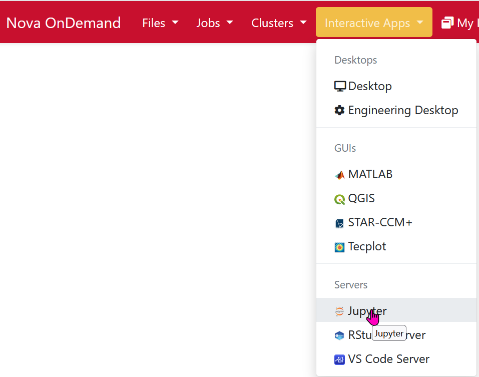
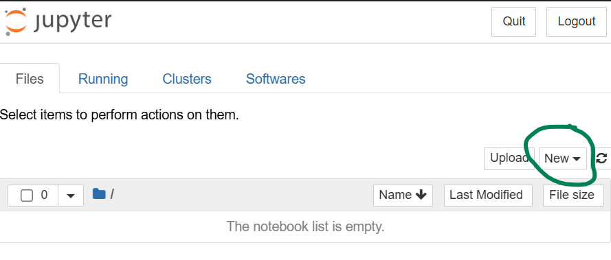
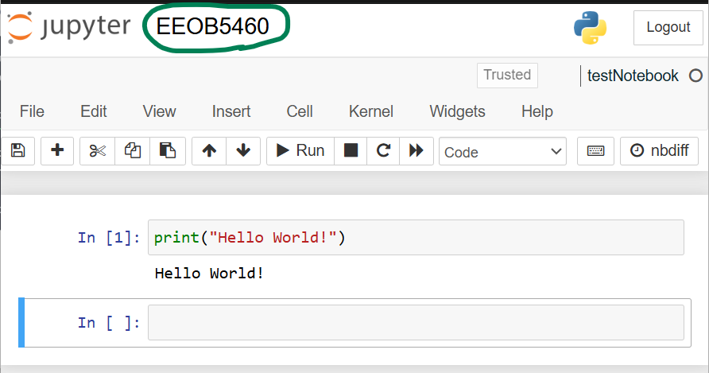

<!-- _class: lead -->

# Writing and documenting code

<div class="twocol-bottom">
<div>

### VS Code
### Jupyter
### PyCharm

</div><div>

### Positron
### Spyder
### Org Mode (if you enjoy suffering)

</div>

---


# A brief history

<div class="twocol-bottom">
<div>

### **Pre-2000s** 
— command line, Perl, text editors like `vi` and `emacs`

### **2000s** 
— R rises, RStudio (2011 - real IDE); MATLAB popular in quantitative fields

</div><div>

### **2010s** 
— Python overtakes Perl; Jupyter Notebook (2014) used for sharing analyses

### **Now** 
— Python and R displaced Perl, other languages and development tools available

</div>

---

# What is Jupyter?

- Stands for **Ju**lia, **Py**thon, **R** — designed to support all three from the start
- A **server-client application** — your browser is the interface, a kernel runs the code
- The document format (`.ipynb`) mixes **code cells, markdown text, and output** in one file
- Currently among the most popular development environments used by data scientists due to its flexibility
- Two flavors: **Jupyter Notebook** (classic) and **JupyterLab** (modern, more IDE-like)

---

# Pros and Cons

<div class="twocol-bottom">
<div>

**Interactive**

**Narrative**: thoughts and code together

**Reproducible**

**Inline visualization**: plots by their code

**Low barrier**: easy to start

</div><div>

**Hidden state problem**: cells can be run out of order

**Version control is painful**: `.ipynb` files are JSON under the hood, so `git diff` is nearly unreadable

**Not built for software**:  writing reusable modules, packages, or pipelines is messy

**Debugging is limited**

**Beginners learn bad habits**: code that only works in one specific order

</div>

---

# The hidden state problem, illustrated

```python
# Cell 1 — run this first
x = 10

# Cell 2 — run this second
x = x * 2

# Cell 3 — now delete Cell 1 and re-run Cell 2
# x is still 20 in memory, so the answer is wrong
# restart the kernel and everything falls apart
```

This is the most common source of "it worked yesterday" problems in Jupyter.
**Restart and run all** before you trust your own notebook.

---

# Other options

| Tool | Best for |
|------|----------|
| **VS Code + Jupyter** | General purpose, notebooks + scripts, strong debugging |
| **Positron** | RStudio expats; built by the Posit team; plot pane, variable explorer |
| **Spyder** | Simple, scientific, very RStudio-like; popular via Anaconda |
| **PyCharm** | Software engineering; heavy but powerful |
| **Google Colab** | Zero install; GPU access; great for sharing and teaching |
| **Org Mode** | Hard Mode |

---
# VS Code + Jupyter: a popular option

You get:
 ✅ Inline plots and cell-by-cell execution (like classic Jupyter)
 ✅ Proper file and project management
 ✅ Real debugging tools
 ✅ Version control that actually works
 ✅ The same editor you'll use for `.py` scripts, pipelines, and everything else

❌ additional setup 
❌ less intuitive interface
❌ still has the hidden state caution

### We will not cover this, but instructions are at the end if you want to use it
---
# Jupyter on Nova
### Open your terminal and SSH to Nova

```bash
ssh <netid>@nova.its.iastate.edu
# Enter your 2FA code and then password 

# Request an interactive session:
salloc -N 1 -n 4 -t 2:00:00 -p interactive
```

You requested a single node (computer) with 4 processors (CPUs) for 2 hours

---

# Load the module for conda

```python
module load micromamba
conda create -n notebook

# proceed with "Y" when prompted
eval "$(micromamba shell hook --shell=bash)"
micromamba activate notebook
(notebook) conda install -c conda-forge jupyterlab ipython \
                             ipykernel notebook
# proceed with "Y" when prompted
```

---

# Success

```bash
Transaction finished
To activate this environment, use:
    $ [micro]mamba activate <environment>
Or to execute a single command in this environment, use:
    $ [micro]mamba run -n <environment> mycommand
```

---

# Active your notebook (still interactive)

```bash
micromamba activate notebook

# Add the env to jupyter kernels
python -m ipykernel install --user --name notebook --display-name "Python3 (EEOB546)"

# Next, install some useful packages
conda install -c conda-forge pandas statsmodels numpy \
                matplotlib seaborn scipy lxml biopython

# when done
exit
```

--- 

## Enter your notebook at https://nova-ondemand.its.iastate.edu



---

# Fill out the form

```bash
Account: <s2026.eeob.546.1>
Queue: <instruction>
Number of hours: <2>
Memory required: <32G>
Number of tasks per node: <4>
GRES (only applies to GPU jobs): <blank>
Job name: <jupyter>
<check>: I would like to receive an email
Jupyter Notebook vs Lab: <Notebook>
Working Directory: <wherever you want>
```

### Then launch the session by clicking Launch.


---

# Jupyter


---
# Rename and test your notebook



---

# Jupyter Notebook Tips
1. Tab is your friend
2. Use `!` to call bash from the notebook
3. Magic commands exist
4. Master the keyboard shortcuts
5. Help is closer than you think
6. Other tips

---
# Use Tab (here and on commandline)
* Tab completion is available in Jupyter Notebook
-- Complete variable names, functions, and methods
-- Explore the structure of objects
-- Discover methods and attributes of objects

---
# `!` can run bash commands within Jupyter
* Note: not all commands work, but the important ones do


---
## Maybe useful magic commands

| Command | Operation |
|---|---|
| `%lsmagic` | List all magic commands |
| `%time` | Measure execution time |
| `%history` | View command history |
| `%env` | Set environment variables |
| `%memit` | Check memory usage |
| `%reset -f` | Clear all variables |
| `%debug` | Start the debugger |
| `%run script.py` | Run an external Python script |

---

# Master the Keyboard Shortcuts

<div class="twocol-bottom">
<div>

**Run cells**
- Ctrl + Enter → run, stay in cell
- Shift + Enter → run, next cell
- Alt + Enter → run, new cell below

<br>

**Add / manage cells**
- Esc + A / B → add above / below
- Esc + D, D → delete cell

</div><div>

**Cell types**
- M → Markdown  
- Y → Code  

<br>

**Editing**
- Ctrl + / → comment / uncomment

<br>

**Tip**
- Press **H** to view all shortcuts  
- You can customize shortcuts

</div>

---

# Getting Help

- Add `?` or `??` after a function to view documentation  
- Press **Shift + Tab (twice)** to see docstring description  
- Use `help(function)` for a detailed description  
- Use `dir(object)` to list available attributes/methods

---
## Other Jupyter Notebook features

- **Markdown**  
  Format text, add images, links, and equations for clear, readable notes  

- **Exporting**  
  Save notebooks as HTML, PDF, slides, or a `.py` script  

- **Widgets**  
  Add interactive elements like sliders, buttons, and dropdowns  

- **Extensions**  
  Install add-ons to expand functionality (e.g., variable inspector, themes)

---

# That's it for this lecture, but keep reading if you want to use VS Code, with or without Jupyter Notebook

---

# If you are interested in setting up VS Code and Jupyter

### Note: since I am not teaching this, I asked Claude (AI) to generate these slides. I've reviewed them, but some of the Mac stuff may not work (I use Windows)

---
# Setting Up VS Code with Jupyter

## Everything you need to write and run Python with inline visualizations

---

# Step 1: Install Python

**All platforms:** Download from [python.org](https://python.org) — get the latest stable version

<br>

**⚠️ Windows only:** During install, check **"Add Python to PATH"**

<br>

**Verify it worked** — open a terminal and run:
```bash
python --version
# Python 3.12.0
```

---

# A Note on Terminals

You'll be using a terminal throughout this course

| OS | App to open |
|----|-------------|
| Windows | Command Prompt or PowerShell |
| Mac | Terminal |
| Linux | Terminal |

### VS Code has a built-in terminal

---

# Step 2: Install VS Code

* Download from [code.visualstudio.com](https://code.visualstudio.com)

* Default install options are fine on all platforms

---

# Step 3: Install the Python Extension

1. Open VS Code
2. Click the **Extensions** icon in the left sidebar (or `Ctrl/Cmd + Shift + X`)
3. Search **"Python"**
4. Install the one by **Microsoft**

This also installs **Pylance** automatically — that's expected and good

---

# Step 4: Install the Jupyter Extension

Same process:

1. Extensions panel
2. Search **"Jupyter"**
3. Install the one by **Microsoft**

This is what gives us inline plots and interactive cells

---

# Step 5: Install the Required Packages

Open the VS Code terminal and run:

```bash
pip install jupyter notebook matplotlib numpy pandas
```

**If `pip` doesn't work on Windows**, try:
```bash
python -m pip install jupyter notebook matplotlib numpy pandas
```

This will take a minute — that's normal

---

# Step 6: Select Your Python Interpreter

VS Code needs to know which Python to use

1. Press `Ctrl/Cmd + Shift + P`
2. Type **"Python: Select Interpreter"**
3. Choose the version you installed from python.org

If you see multiple options and aren't sure — pick the one that shows the version number you installed

---

# Step 7: Create Your First Notebook

1. Open a folder in VS Code (`File → Open Folder`) — always work inside a folder
2. Create a new file and name it `test.ipynb`
3. VS Code will open it as a notebook automatically

Click **"+ Code"** to add a cell and type:
```python
print("it works")
```
Click the ▷ button or press `Shift + Enter` to run it

---

# Step 8: Test Inline Plotting

Add a new cell and run this:

```python
import matplotlib.pyplot as plt

plt.plot([1, 2, 3, 4], [1, 4, 9, 16])
plt.title("My first plot")
plt.show()
```

The plot should appear **directly below the cell**

If it does — you're all set

---

# The Two Things to Remember

**Always open a folder, not a file**
`File → Open Folder` keeps your work organized and prevents a lot of headaches

**Run cells with `Shift + Enter`**
It runs the current cell and moves to the next one — you'll use this constantly

---

# If Something Went Wrong

Most setup problems fall into one of these:

- **Python not found** → Windows PATH issue, re-run the installer and check the box
- **pip not found** → use `python -m pip` instead
- **Plots not showing inline** → make sure the Jupyter extension is installed and you're in a `.ipynb` file, not a `.py` file
- **Wrong interpreter selected** → `Ctrl/Cmd + Shift + P` → "Python: Select Interpreter"

